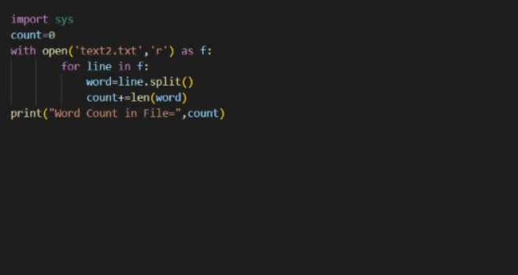

# command-line-arguments-to-count-word
## AIM:
To write a python program for getting the word count from the contents of a file using command line arguments.
## EQUIPEMENT'S REQUIRED: 
PC
Anaconda - Python 3.7
## ALGORITHM: 
### Step 1:
import sys

### Step 2:
Then decleare count is equal to 0

### Step 3:
read the file with python file name

### Step 4:
Splitting the word

### Step 5:
After splitting count the number of words in the line

### Step 6:
In last statement give the print statement

## PROGRAM:
```
Developed by : Roshini T
Register no : 23011660
import sys
count=0
with open(sys.argv[1],'r) as f:
    for line in f:
    word=line.split()
    count+=line.(word)
print("Word Count in File=",count)
```
### OUTPUT:



## RESULT:
Thus the program is written to find the word count from the contents of a file using command line arguments.
